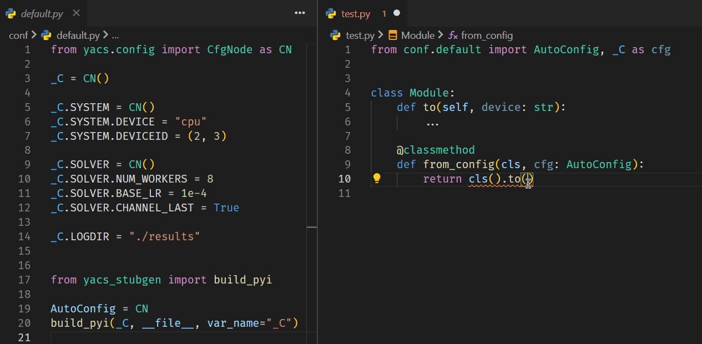

# yacs-stubgen

Add typing support for your YACS config by generating stub file.

[][home]
[][pypi]
[](https://github.com/JamzumSum/yacs-stubgen/actions/workflows/test-pub.yml)



## Install

Install from PyPI:

```sh
pip install yacs-stubgen
```

<details>

<summary>Other methods</summary>

Install from this repo directly:

```sh
pip install git+https://github.com/JamzumSum/yacs-stubgen.git
```

Or you can download from our GitHub release and install package manually.

</details>

## Usage

### Auto-Generate

Add typing support for your [yacs][yacs] config by appending just three lines:

```py
from yacs.config import CfgNode as CN

_C.MODEL.DEVICE = 'cuda'
...
# your config items above

# this line can be moved to the import header
from yacs_stubgen import build_pyi
# this alias ensure you can import `AutoConfig` and use something like `isinstance`
AutoConfig = CN
# _C is the CfgNode object, "_C" should be its varname correctly
# AutoConfig is an alias of CfgNode, "AutoConfig" should be its varname correctly
build_pyi(_C, __file__, cls_name='AutoConfig', var_name='_C')
```

**After** any run/import of this file, a stub file (*.pyi) will be generated.
Then you will get typing and auto-complete support **if your IDE supports stub files**.

Each time you change your config, you have to run/import this file again to apply the changes.

### Build Script

We have provided a script as an entrypoint. Simply run `yacstub <file/dir>` and it
will generate stub file if one module contains a `CfgNode` object in global scope.

```sh
> yacstub ./conf    # specify a directory
INFO: Generated conf/default.pyi
> yacstub ./conf/default.py # specify a file
INFO: Generated conf/default.pyi
```

Similarly, each time you change the config, you have to re-run the script to apply the changes.

## How it works

<details>

**Stub files take precedence** in the case of both `filename.py` and `filename.pyi` exists.
Once you pass in the config node, we will iterate over it and generate a stub file then save
it as `filename.pyi` (that's why a path is required). Now supporting IDE will detect the stub
file and is able to type-check and intellisense your code.

However, the stub file does nothing with actual code executing. If you import the generated
class (default as "AutoConfig"), an `ImportError` will be raised. This time you can add a variable
(aka. type alias) refers to `CfgNode` in the `*.py` file. We will override the type of this alias
to our generated class ("AutoConfig") in the stub file. Thus you can import the "AutoConfig"
normally and intuitively, while the type alias is treated as "AutoConfig" by IDE but is actually a `CfgNode` type.

</details>

## License

- [MIT](LICENSE)
- [yacs][yacs] is under [Apache-2.0](https://github.com/rbgirshick/yacs/LICENSE)

[yacs]: https://github.com/rbgirshick/yacs
[home]: https://github.com/JamzumSum/yacs-stubgen
[pypi]: https://pypi.org/project/yacs-stubgen
